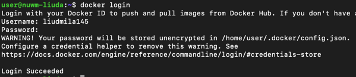
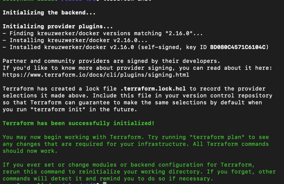
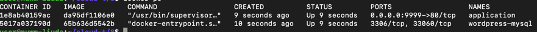

Завантажено збілджений образ із минулого завдання на docker hub.

Для цього авторизувались аккаунтом docker hub в докер.

Створено конфіг для terraform, файл main.tf

Тоді будо ініціалізовано terraform командою terraform init та піднято інфраструктуру командою terraform apply

